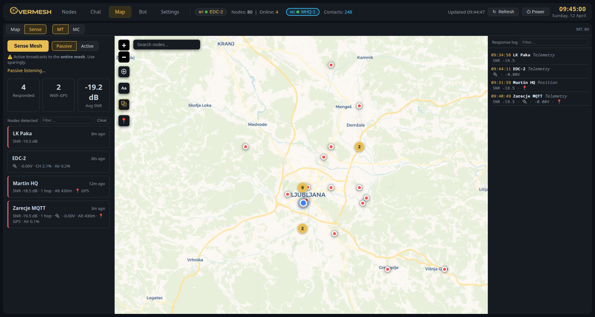
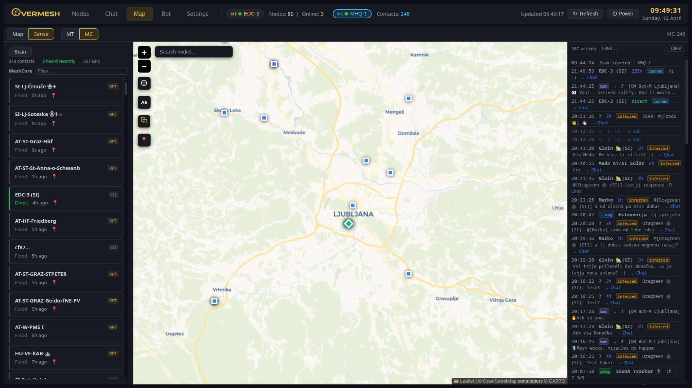
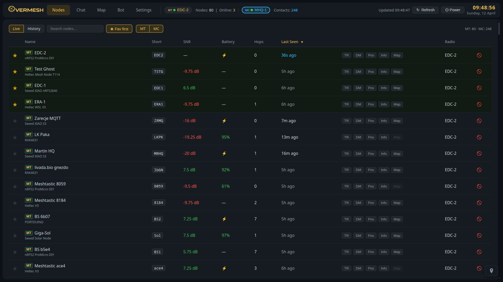
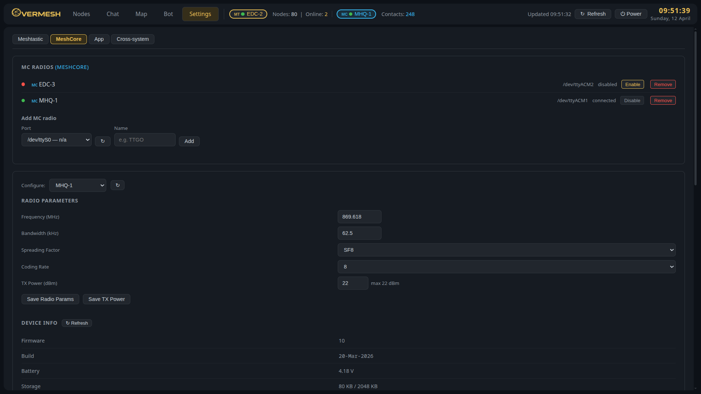
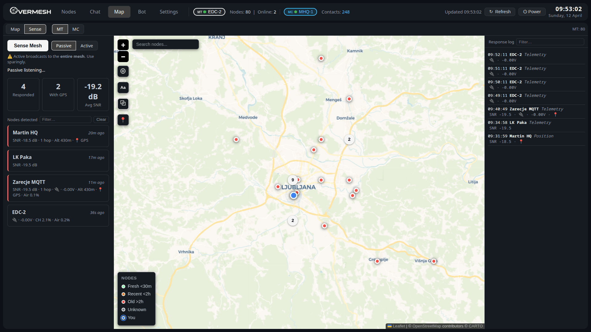

# OverMesh

**v2.0** — Meshtastic + MeshCore, unified.

OverMesh is a self-hosted dashboard for Meshtastic and MeshCore. It runs on your own machine, uses your own radios, and keeps everything local, no cloud, no account, no subscription.

This is now the main active OverMesh app. Meshtastic and MeshCore are treated as two equal parts of one tool, not as separate side projects.

> **Active development** This app is actively used and still changing. Expect a few rough edges.

---

## What OverMesh does

OverMesh gives you one place to work with both networks. You can watch nodes on the map, use chat on either system, run Sense, manage radios and channels, use the bot, and bridge traffic between MT and MC when needed.

The app is built around real use, not just setup screens. The idea is simple: one interface where you can actually watch the mesh, talk on it, and manage it.

---

## Screenshots


*Meshtastic Sense with live node response log and map view*


*MeshCore Sense with heard-recently contact list, map markers, and activity log*


*Live Nodes view with MT and MC available in one interface*


*MeshCore radio settings and device controls*

---

## Main features

OverMesh covers the main things you actually need in daily use: maps, chat, direct messages, multi-radio support, Sense, bot tools, settings, notifications, and offline map tiles.

### Meshtastic

- live node map with labels, age coloring, and quick actions
- channel chat, direct messages, unread indicators, and per-radio history
- traceroute, node info, position request, and direct-message actions
- radio settings for identity, LoRa, channels, position, power, display, telemetry, MQTT, Bluetooth, and WiFi
- per-channel history cleanup from Settings

### MeshCore

- multi-radio MeshCore support
- MC contacts on the Nodes tab and on the map
- MC chat with channel tabs, DM tabs, delivery state, unread indicators, and local saved message history
- route and hop-count badges on received MC messages, with path visualization on the map
- MC radio settings, channel management, device info, coordinates, TX power, path-hash mode, and reboot tools
- MC advert controls (local or flood) directly from the chat toolbar
- MC bot support, MC Sense activity integration, and per-channel history cleanup from Settings

### Shared / app-wide

- MT and MC visible together in one app
- map and Nodes views designed to stay as similar as possible across both systems
- Mesh Sense with route/hop path visualization
- offline maps
- in-app notifications for messages, new nodes, and nodes seen again after a long gap, with per-type sound toggles
- browser notifications and tab unread message count
- accent color and zoom settings
- searchable in-app manual
- Settings → App update checker

---

## Requirements

- Python 3.9+
- Linux is the primary tested platform and the strongest target environment
- at least one Meshtastic or MeshCore radio

OverMesh is built first around practical Linux use, including Filip's cyberdeck workflow, but the app should stay reasonably usable on Windows and macOS too where the underlying radio tooling allows it.

## Platform support

- Linux: best-supported path, primary development target, and the most natural fit for attached radios and long-running service use
- Windows: usable for direct app runs, but less tested than Linux
- macOS: possible for direct app runs, but less tested than Linux

For now, native installs are the priority. Docker and similar deployment options can come later if they are useful, but they are not the main install path.

---

## Install

### Linux

The easiest path for Linux, especially for long-running or service installs, is the included install script:

```bash
git clone https://github.com/Slofi/overmesh.git
cd overmesh
chmod +x install.sh
./install.sh
```

The script installs Python dependencies, copies the config template, and sets up and enables a systemd user service with the correct paths substituted. After it finishes:

```bash
systemctl --user start overmesh
```

Then open `http://localhost:8082` and add your radios from Settings.

**Manual install (venv)**

If you prefer a virtual environment or just want to run it directly:

```bash
git clone https://github.com/Slofi/overmesh.git
cd overmesh
python3 -m venv venv
source venv/bin/activate
pip install -r requirements.txt
cp config.example.json config.json
python3 app.py
```

> A virtual environment is recommended. Modern Linux distros often block system-wide `pip install`.

Then open `http://localhost:8082`. You can add radios from the UI in `Settings`.

### Windows

1. Install Python 3.9 or newer from [python.org](https://www.python.org/downloads/) — check **Add Python to PATH** during install
2. Clone or download this repo and open the folder in Command Prompt or PowerShell
3. Set up the environment:

```powershell
py -m venv venv
venv\Scripts\activate
pip install -r requirements.txt
copy config.example.json config.json
```

> **PowerShell note:** If `venv\Scripts\activate` fails with "running scripts is disabled", either use Command Prompt instead, or run `Set-ExecutionPolicy -Scope Process -ExecutionPolicy Bypass` first.

4. Run it:

```powershell
py app.py
```

Then open `http://localhost:8082` and add your radios from Settings.

For subsequent launches you can use `start-overmesh.bat` — it automatically uses the venv if present, or falls back to system Python.

> Serial ports on Windows appear as `COM3`, `COM4`, etc. — not `/dev/tty...` paths. Use Device Manager to find the right port for your radio.

### macOS

1. Install Python 3.9 or newer
2. Clone or download this repo and open Terminal in the repo folder
3. Set up the environment:

```bash
python3 -m venv venv
source venv/bin/activate
pip install -r requirements.txt
cp config.example.json config.json
```

4. Run it:

```bash
python3 app.py
```

Then open `http://localhost:8082` and add your radios from Settings.

### First run notes

- The starter config is just a basic template
- You can add radios from the UI after startup in `Settings`
- Serial device names vary by platform, so do not assume Linux-style `/dev/...` paths on Windows or macOS
- If you only use one system, the app still works fine

---

## Quick start

1. Start the app
2. Open `Settings`
3. Add an MT radio, an MC radio, or both
4. Go to `Chat`, `Nodes`, or `Map`
5. Use the radio pills and MT/MC toggles to switch views

If you only use one system, that is fine. If you use both, OverMesh keeps them together in one interface.

---

## Configuration

`config.json` stores app and radio settings. In normal use, most radio setup can be done from the UI, so you usually only touch the file for first setup or custom deployments.

Key values include:

- `nodes` — list of Meshtastic radios
- `mc_nodes` — list of MeshCore radios
- `port` — default `8082`
- `host` — default `0.0.0.0`
- `app.zoom` — UI zoom level
- `app.accent_color` — accent color hex
- `sense_passive` — enable passive Sense logging
- `sense_active_auto` — auto-run active Sense on connect
- `cross.rules` — cross-system forwarding rules
- `bridge` — webhook, ingest, and MQTT bridge settings
- `gps` — optional GPS receiver config (`enabled`, `port`); not included in the example config, disabled by default

Environment variables override config file values:

- `OVERMESH_CONFIG` — path to a custom config file
- `OVERMESH_DATA_DIR` — directory for data files (DBs, etc.)
- `OVERMESH_HOST` — bind host
- `OVERMESH_PORT` — bind port

---

## Running as a service

The recommended way to set up the service on Linux is `./install.sh`, which handles path substitution automatically.

If you prefer to do it manually, the `overmesh.service` file contains placeholder tokens that must be replaced before copying:

```bash
sed \
    -e "s#APP_DIR#$(pwd)#g" \
    -e "s#PYTHON_BIN#$(command -v python3)#g" \
    overmesh.service > ~/.config/systemd/user/overmesh.service
systemctl --user daemon-reload
systemctl --user enable --now overmesh.service
```

> Do not `cp` the service file directly — the placeholders will not resolve and the service will fail to start.

Logs:

```bash
journalctl --user -u overmesh -f
```

This is a Linux convenience option. Windows and macOS users run it directly with `py app.py` or `python3 app.py`.

---

## Known limits

- some MC metadata, such as per-message SNR, is best-effort rather than guaranteed
- the app is still evolving, so some UI details will keep changing

---

## Update log

Recent work has moved OverMesh much closer to feeling like one real dual-network app instead of two uneven halves.

The big changes were better MC support across the app, cleaner MT and MC UI parity, better heard-recently logic, in-app notifications, and per-channel history deletion on both systems.

OverMesh is now clearly the MT plus MC app.

If you want the short public summary, see `RELEASE_NOTES.md` in this repo.

If you are coming from the older OverMesh setup, see `MIGRATION.md`.

---

## Theme customization

OverMesh has an app-wide accent color setting, so you can change the look without changing the layout.


*Example of the accent color applied across the app*

For the background story behind the project, see `ABOUT.md`.

---

## Project structure

| File | Purpose |
|------|---------|
| `app.py` | Flask app startup, routes, shutdown handling |
| `mesh.py` | Meshtastic connect, reconnect, packet handling |
| `mesh_mc.py` | MeshCore async bridge and event handling |
| `bot.py` | Bot logic |
| `cross.py` | Cross-system forwarding logic |
| `db.py` | SQLite storage |
| `helpers.py` | SSE push and helper functions |
| `routes/` | Flask blueprints by feature area |
| `templates/index.html` | Main frontend UI |

---

## License

MIT

---

[](https://www.buymeacoffee.com/slofi)
