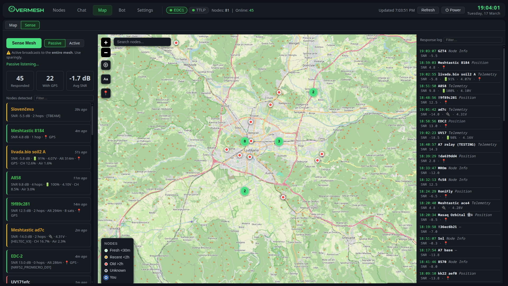
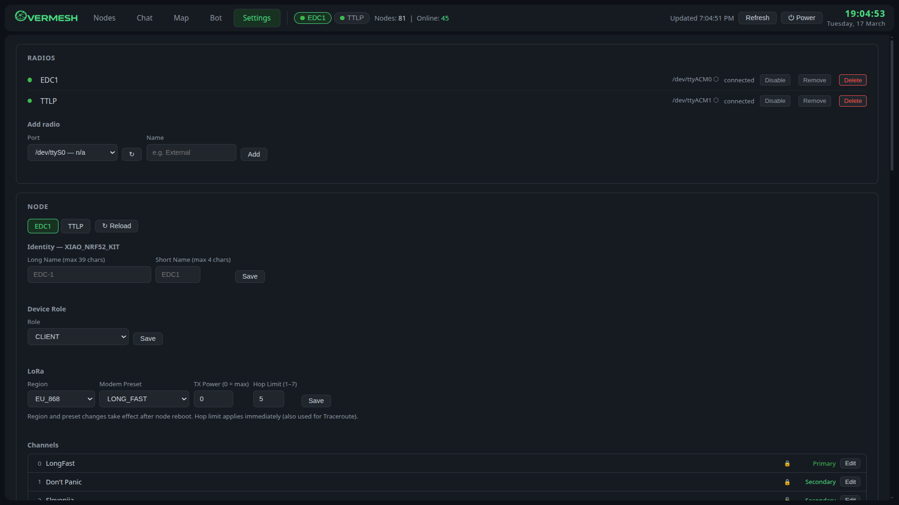
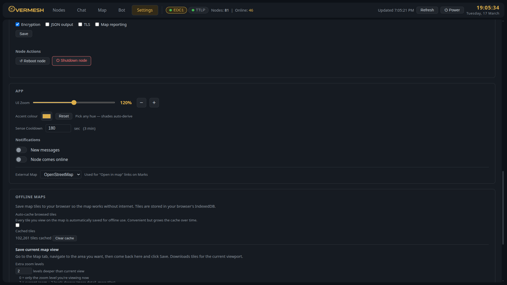

# OverMesh

A self-hosted Meshtastic dashboard. Runs on your machine, no cloud, no account, no subscription.

> **Active development** — OverMesh is being actively developed and tested. Expect rough edges, and feel free to open an issue if you find one.

---


*Mesh Sense overlay — passive listening, live response log, node map*


*Multi-radio management and node configuration*


*App settings, accent theming, and offline map tile caching*

---

## Features

- **Live node map**: GPS markers, cluster grouping for co-located nodes, map position memory
- **Offline maps**: tile caching in browser IndexedDB, downloadable regions, custom zoom levels
- **Chat**: channel tabs, direct messages, unread indicators per radio
- **Mesh Sense**: passive listening and active scan overlay; detects nodes without querying them
- **Marks**: create, send, and delete waypoints over the mesh (syncs to Android MT app)
- **Bot**: automated replies (ping, sitrep, relay, joke...), scheduled MOTD broadcast
- **Traceroute**: hop-by-hop route visualization with SNR per link
- **Multi-radio**: connect several nodes simultaneously, switch active radio from the header
- **Node settings**: configure identity, LoRa, channels, fixed position directly from the UI
- **Browser notifications**: new messages and node online events
- **Theming**: accent color picker, zoom scaling, dark UI throughout

---

## Requirements

- Python 3.9+
- A Meshtastic node connected via USB serial
- **Platform:** Linux ✓ Windows ✓

---

## Install

**Linux / macOS:**
```bash
git clone https://github.com/Slofi/overmesh.git
cd overmesh
python3 -m venv venv
source venv/bin/activate
pip install -r requirements.txt
cp config.example.json config.json
```

> **Note:** A virtual environment is recommended — modern Linux distros (Fedora, Ubuntu 23.04+, Bazzite, etc.) block system-wide `pip install` by default. Do **not** run with `sudo`.

**Windows:**
```bat
git clone https://github.com/Slofi/overmesh.git
cd overmesh
python -m venv venv
venv\Scripts\activate
pip install -r requirements.txt
copy config.example.json config.json
```

### Windows Notes

**PowerShell users:** If `venv\Scripts\activate` fails with "running scripts is disabled", either:
- Use Command Prompt (cmd) instead of PowerShell, or
- Run: `Set-ExecutionPolicy -Scope Process -ExecutionPolicy Bypass` first

**Serial ports:** Windows uses `COM3`, `COM4`, etc. (not `/dev/ttyUSB0`). Find your port in Device Manager → Ports (COM & LPT).

**Easiest setup:** Skip editing config.json — just run the app and add your radio in Settings → Radios using the port dropdown.

---

Edit `config.json` and set your node's serial port (`/dev/ttyUSB0`, `/dev/ttyACM0` on Linux, or `COM3` on Windows) and a name for it. TCP/WiFi nodes can be added directly from the Settings → Radios UI after startup — no manual config editing needed.

**Linux / macOS:**
```bash
python3 app.py
```

**Windows:**
```bat
start-overmesh.bat
```
Or simply: `python app.py`

Open [http://localhost:8081](http://localhost:8081).

---

## Configuration

`config.json` reference:

| Key | Description | Default |
|-----|-------------|---------|
| `nodes[].port` | Serial port of the node | `/dev/ttyUSB0` |
| `nodes[].name` | Display name | `MyNode` |
| `nodes[].enabled` | Include this node on startup | `true` |
| `nodes[].type` | `serial` or `tcp` | `serial` |
| `nodes[].host` | IP or hostname (TCP nodes only) | — |
| `nodes[].tcp_port` | TCP port (TCP nodes only) | `4403` |
| `port` | Web server port | `8081` |
| `host` | IP address Flask binds to | `0.0.0.0` |
| `app.zoom` | UI zoom level (75–125) | `100` |
| `app.accent_color` | Hex accent color | `#4ade80` |
| `sense_passive` | Start passive Sense listening on launch | `false` |

Nodes can be added and configured through **Settings → Radios** in the UI — no need to edit the file manually after the first run.

### Environment variables

For container and non-default deployments, these override the corresponding config values:

| Variable | Description |
|----------|-------------|
| `OVERMESH_CONFIG` | Path to `config.json` |
| `OVERMESH_DATA_DIR` | Directory for databases (`overmesh_prefs.db`, per-radio message DBs) |
| `OVERMESH_HOST` | Flask bind address (overrides `host` in config) |
| `OVERMESH_PORT` | Flask port (overrides `port` in config) |

If not set, behaviour is identical to a plain `python3 app.py` run.

### TCP / WiFi nodes

Nodes with WiFi (T-Beam, Heltec WiFi, etc.) can be connected over the network instead of USB. In **Settings → Radios → Add radio**, switch the type toggle to **TCP / WiFi**, enter the node's IP address, and click Add. The default port is `4403` (Meshtastic standard). The node must have WiFi configured and be reachable on your network.

---

## Running as a service (Linux)

A `overmesh.service` systemd unit file is included. Copy it and enable it:

```bash
cp overmesh.service ~/.config/systemd/user/
systemctl --user daemon-reload
systemctl --user enable --now overmesh.service
```

Logs: `journalctl --user -u overmesh -f`

---

## Uninstall

```bash
systemctl --user disable --now overmesh
rm -rf ~/overmesh
```

---

## Notes

- Map tiles: [OpenStreetMap](https://www.openstreetmap.org/) — © OpenStreetMap contributors ([ODbL](https://www.openstreetmap.org/copyright))
- Offline tile caching is browser-side (IndexedDB); tiles stay on your machine

---

## About

See [ABOUT.md](ABOUT.md) for the background story.

---

## Project structure

For developers and contributors — the codebase is split into modules:

| File | Contents |
|------|----------|
| `app.py` | Flask init, blueprint registration, startup sequence |
| `config.py` | Config loading, `CONFIG` dict, `DATA_DIR`, `save_config()` |
| `state.py` | Shared mutable globals: connections, chat buffer, SSE clients |
| `db.py` | SQLite — prefs DB, per-radio message DBs, node history |
| `helpers.py` | SSE push, node data aggregation, lookup helpers |
| `mesh.py` | Interface connect/reconnect loops, packet callbacks, node queries |
| `gps.py` | GPS receiver reader, NMEA parser, position push to nodes |
| `sense.py` | Mesh Sense broadcast, passive listener, auto-loop |
| `bot.py` | Command handling, MOTD scheduler, per-radio bot config |
| `routes/` | Flask Blueprints — one file per feature area |

---

## License

MIT

---

[](https://www.buymeacoffee.com/slofi)
